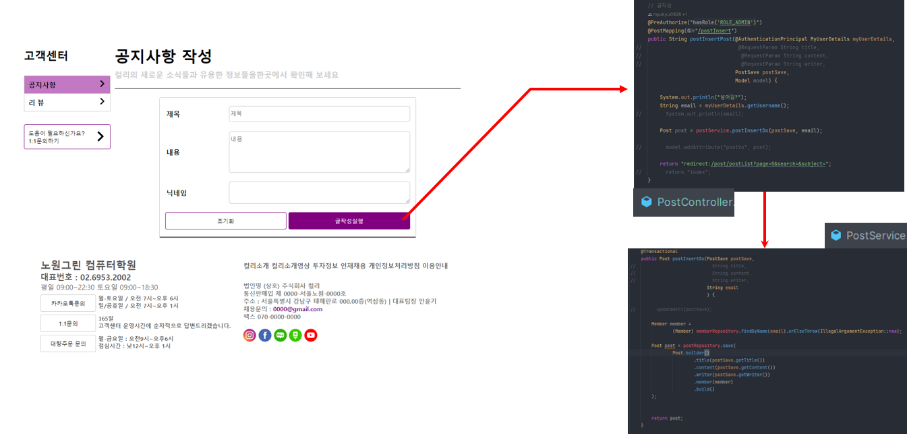
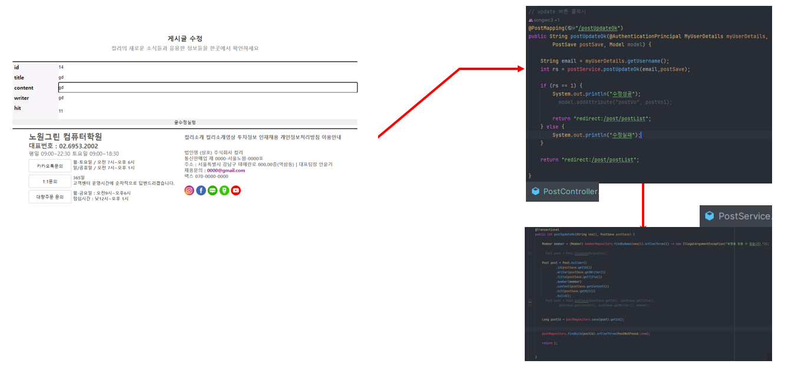
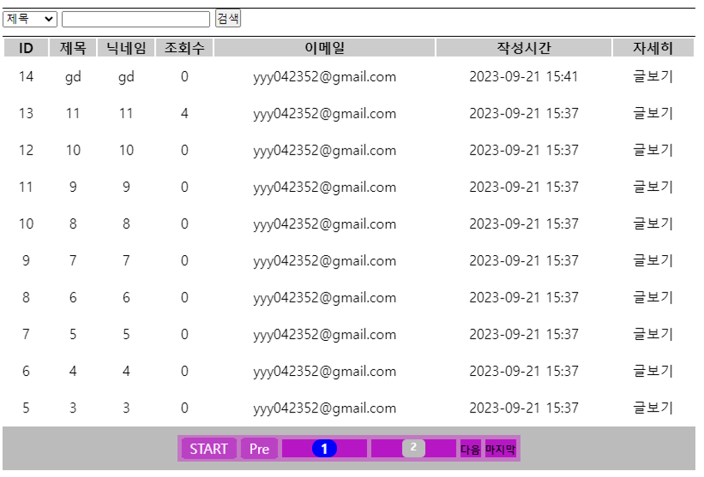
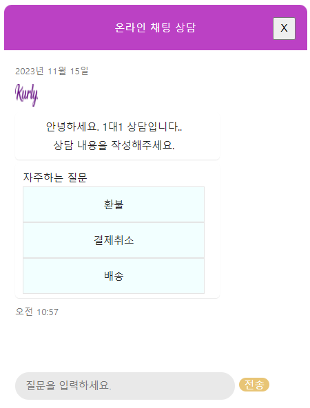
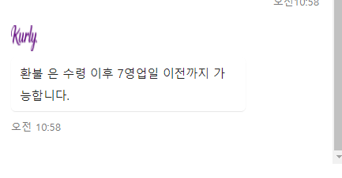
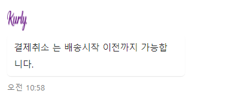
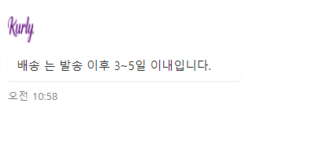

# 쇼핑몰 프로젝트 - 마켓컬리

## 데이터베이스

## Skiis

## 🪝 팀원
<table>
  <tbody>  
        <tr>
      <td align="center">
<a href="https://github.com/AHNYUNKI">
 <b>팀장, BE : 안윤기</b></a> 
      </td>
      <td align="center">
<a href="https://github.com/shengu9">
 <b>BE : 이현구</b></a> 
      </td>
      <td align="center">
<a href="https://github.com/yyy2724">
 <b>BE : 김양현</b></a> 
    </tr>
</tbody>
</table>

### 김양현

게시판 CRUD

  

글 작성
  

글 수정
  

글 리스트( paging, 및 search)
  

삭제 및 댓글
  

챗봇

  
질문에 따른 시나리오를 작성하였습니다.

